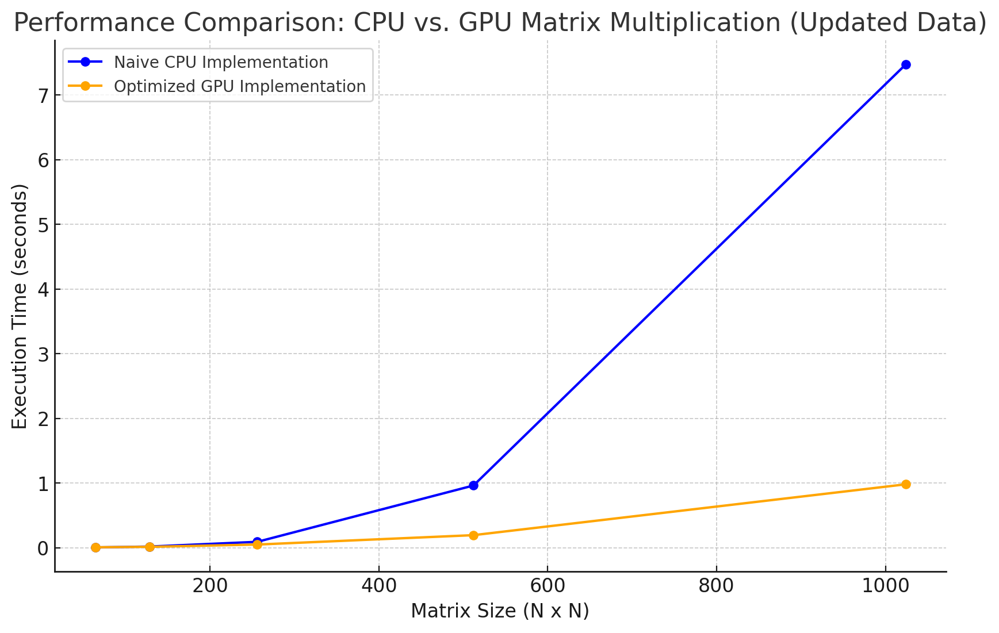

# MiniTorch Module 3


* Docs: https://minitorch.github.io/

* Overview: https://minitorch.github.io/module3.html


You will need to modify `tensor_functions.py` slightly in this assignment.

* Tests:

```
python run_tests.py
```

* Note:

Several of the tests for this assignment will only run if you are on a GPU machine and will not
run on github's test infrastructure. Please follow the instructions to setup up a colab machine
to run these tests.

This assignment requires the following files from the previous assignments. You can get these by running

```bash
python sync_previous_module.py previous-module-dir current-module-dir
```

The files that will be synced are:

        minitorch/tensor_data.py minitorch/tensor_functions.py minitorch/tensor_ops.py minitorch/operators.py minitorch/scalar.py minitorch/scalar_functions.py minitorch/module.py minitorch/autodiff.py minitorch/module.py project/run_manual.py project/run_scalar.py project/run_tensor.py minitorch/operators.py minitorch/module.py minitorch/autodiff.py minitorch/tensor.py minitorch/datasets.py minitorch/testing.py minitorch/optim.py

## 3.1 Diagnostic Output

MAP
OMP: Info #276: omp_set_nested routine deprecated, please use omp_set_max_active_levels instead.

================================================================================
 Parallel Accelerator Optimizing:  Function tensor_map.<locals>._map,
/Users/angelagui/Documents/MLE/mod3-xgui2001/minitorch/fast_ops.py (191)
================================================================================


Parallel loop listing for  Function tensor_map.<locals>._map, /Users/angelagui/Documents/MLE/mod3-xgui2001/minitorch/fast_ops.py (191)
--------------------------------------------------------------------------------|loop #ID
    def _map(                                                                   |
        out: Storage,                                                           |
        out_shape: Shape,                                                       |
        out_strides: Strides,                                                   |
        in_storage: Storage,                                                    |
        in_shape: Shape,                                                        |
        in_strides: Strides,                                                    |
    ) -> None:                                                                  |
        # When tensors are aligned                                              |
        if check_arrays_match(out_strides, in_strides, out_shape, in_shape):    |
            for i in prange(len(out)):------------------------------------------| #2
                out[i] = fn(in_storage[i])                                      |
            return                                                              |
        else:                                                                   |
            # When tensors are not aligned                                      |
            for i in prange(len(out)):------------------------------------------| #3
                out_idx: Index = np.zeros(MAX_DIMS, dtype=np.int32)-------------| #0
                to_index(i, out_shape, out_idx)                                 |
                                                                                |
                in_idx: Index = np.zeros(MAX_DIMS, dtype=np.int32)--------------| #1
                broadcast_index(out_idx, out_shape, in_shape, in_idx)           |
                                                                                |
                out_pos = index_to_position(out_idx, out_strides)               |
                in_pos = index_to_position(in_idx, in_strides)                  |
                                                                                |
                out[out_pos] = fn(in_storage[in_pos])                           |
--------------------------------- Fusing loops ---------------------------------
Attempting fusion of parallel loops (combines loops with similar properties)...
Following the attempted fusion of parallel for-loops there are 3 parallel for-
loop(s) (originating from loops labelled: #2, #3, #0).
--------------------------------------------------------------------------------
---------------------------- Optimising loop nests -----------------------------
Attempting loop nest rewrites (optimising for the largest parallel loops)...

+--3 is a parallel loop
   +--0 --> rewritten as a serial loop
   +--1 --> rewritten as a serial loop
--------------------------------------------------------------------------------
----------------------------- Before Optimisation ------------------------------
Parallel region 0:
+--3 (parallel)
   +--0 (parallel)
   +--1 (parallel)


--------------------------------------------------------------------------------
------------------------------ After Optimisation ------------------------------
Parallel region 0:
+--3 (parallel)
   +--0 (serial)
   +--1 (serial)


Parallel region 0 (loop #3) had 0 loop(s) fused and 2 loop(s) serialized as part
 of the larger parallel loop (#3).
--------------------------------------------------------------------------------
--------------------------------------------------------------------------------

---------------------------Loop invariant code motion---------------------------
Allocation hoisting:
The memory allocation derived from the instruction at
/Users/angelagui/Documents/MLE/mod3-xgui2001/minitorch/fast_ops.py (210) is
hoisted out of the parallel loop labelled #3 (it will be performed before the
loop is executed and reused inside the loop):
   Allocation:: in_idx: Index = np.zeros(MAX_DIMS, dtype=np.int32)
    - numpy.empty() is used for the allocation.
The memory allocation derived from the instruction at
/Users/angelagui/Documents/MLE/mod3-xgui2001/minitorch/fast_ops.py (207) is
hoisted out of the parallel loop labelled #3 (it will be performed before the
loop is executed and reused inside the loop):
   Allocation:: out_idx: Index = np.zeros(MAX_DIMS, dtype=np.int32)
    - numpy.empty() is used for the allocation.
None
ZIP

================================================================================
 Parallel Accelerator Optimizing:  Function tensor_zip.<locals>._zip,
/Users/angelagui/Documents/MLE/mod3-xgui2001/minitorch/fast_ops.py (244)
================================================================================


Parallel loop listing for  Function tensor_zip.<locals>._zip, /Users/angelagui/Documents/MLE/mod3-xgui2001/minitorch/fast_ops.py (244)
---------------------------------------------------------------------------------------|loop #ID
    def _zip(                                                                          |
        out: Storage,                                                                  |
        out_shape: Shape,                                                              |
        out_strides: Strides,                                                          |
        a_storage: Storage,                                                            |
        a_shape: Shape,                                                                |
        a_strides: Strides,                                                            |
        b_storage: Storage,                                                            |
        b_shape: Shape,                                                                |
        b_strides: Strides,                                                            |
    ) -> None:                                                                         |
        # When tensors are aligned                                                     |
        if check_arrays_match(                                                         |
            out_strides, a_strides, out_shape, a_shape                                 |
        ) and check_arrays_match(out_strides, b_strides, out_shape, b_shape):          |
            for i in prange(len(out)):-------------------------------------------------| #7
                out[i] = fn(a_storage[i], b_storage[i])                                |
        else:                                                                          |
            # When tensors are not aligned                                             |
            for i in prange(len(out)):-------------------------------------------------| #8
                out_idx: Index = np.zeros(MAX_DIMS, dtype=np.int32)--------------------| #4
                a_idx: Index = np.zeros(MAX_DIMS, dtype=np.int32)----------------------| #5
                b_idx: Index = np.zeros(MAX_DIMS, dtype=np.int32)----------------------| #6
                                                                                       |
                to_index(i, out_shape, out_idx)                                        |
                broadcast_index(out_idx, out_shape, a_shape, a_idx)                    |
                broadcast_index(out_idx, out_shape, b_shape, b_idx)                    |
                                                                                       |
                out_pos = index_to_position(out_idx, out_strides)                      |
                a_pos = index_to_position(a_idx, a_strides)                            |
                b_pos = index_to_position(b_idx, b_strides)                            |
                                                                                       |
                out[out_pos] = fn(float(a_storage[a_pos]), float(b_storage[b_pos]))    |
--------------------------------- Fusing loops ---------------------------------
Attempting fusion of parallel loops (combines loops with similar properties)...

Fused loop summary:
+--4 has the following loops fused into it:
   +--5 (fused)
   +--6 (fused)
Following the attempted fusion of parallel for-loops there are 3 parallel for-
loop(s) (originating from loops labelled: #7, #8, #4).
--------------------------------------------------------------------------------
---------------------------- Optimising loop nests -----------------------------
Attempting loop nest rewrites (optimising for the largest parallel loops)...

+--8 is a parallel loop
   +--4 --> rewritten as a serial loop
--------------------------------------------------------------------------------
----------------------------- Before Optimisation ------------------------------
Parallel region 0:
+--8 (parallel)
   +--4 (parallel)
   +--5 (parallel)
   +--6 (parallel)


--------------------------------------------------------------------------------
------------------------------ After Optimisation ------------------------------
Parallel region 0:
+--8 (parallel)
   +--4 (serial, fused with loop(s): 5, 6)


Parallel region 0 (loop #8) had 2 loop(s) fused and 1 loop(s) serialized as part
 of the larger parallel loop (#8).
--------------------------------------------------------------------------------
--------------------------------------------------------------------------------

---------------------------Loop invariant code motion---------------------------
Allocation hoisting:
The memory allocation derived from the instruction at
/Users/angelagui/Documents/MLE/mod3-xgui2001/minitorch/fast_ops.py (264) is
hoisted out of the parallel loop labelled #8 (it will be performed before the
loop is executed and reused inside the loop):
   Allocation:: out_idx: Index = np.zeros(MAX_DIMS, dtype=np.int32)
    - numpy.empty() is used for the allocation.
The memory allocation derived from the instruction at
/Users/angelagui/Documents/MLE/mod3-xgui2001/minitorch/fast_ops.py (265) is
hoisted out of the parallel loop labelled #8 (it will be performed before the
loop is executed and reused inside the loop):
   Allocation:: a_idx: Index = np.zeros(MAX_DIMS, dtype=np.int32)
    - numpy.empty() is used for the allocation.
The memory allocation derived from the instruction at
/Users/angelagui/Documents/MLE/mod3-xgui2001/minitorch/fast_ops.py (266) is
hoisted out of the parallel loop labelled #8 (it will be performed before the
loop is executed and reused inside the loop):
   Allocation:: b_idx: Index = np.zeros(MAX_DIMS, dtype=np.int32)
    - numpy.empty() is used for the allocation.
None
REDUCE

================================================================================
 Parallel Accelerator Optimizing:  Function tensor_reduce.<locals>._reduce,
/Users/angelagui/Documents/MLE/mod3-xgui2001/minitorch/fast_ops.py (302)
================================================================================


Parallel loop listing for  Function tensor_reduce.<locals>._reduce, /Users/angelagui/Documents/MLE/mod3-xgui2001/minitorch/fast_ops.py (302)
------------------------------------------------------------------|loop #ID
    def _reduce(                                                  |
        out: Storage,                                             |
        out_shape: Shape,                                         |
        out_strides: Strides,                                     |
        a_storage: Storage,                                       |
        a_shape: Shape,                                           |
        a_strides: Strides,                                       |
        reduce_dim: int,                                          |
    ) -> None:                                                    |
        # Perform reduction in parallel                           |
        for i in prange(len(out)):--------------------------------| #10
            out_idx = np.zeros(len(out_shape), dtype=np.int32)----| #9
            to_index(i, out_shape, out_idx)                       |
            out_pos = index_to_position(out_idx, out_strides)     |
            reduce_size = a_shape[reduce_dim]                     |
            for s in range(reduce_size):                          |
                out_idx[reduce_dim] = s                           |
                a_pos = index_to_position(out_idx, a_strides)     |
                out[i] = fn(out[out_pos], a_storage[a_pos])       |
--------------------------------- Fusing loops ---------------------------------
Attempting fusion of parallel loops (combines loops with similar properties)...
Following the attempted fusion of parallel for-loops there are 2 parallel for-
loop(s) (originating from loops labelled: #10, #9).
--------------------------------------------------------------------------------
---------------------------- Optimising loop nests -----------------------------
Attempting loop nest rewrites (optimising for the largest parallel loops)...

+--10 is a parallel loop
   +--9 --> rewritten as a serial loop
--------------------------------------------------------------------------------
----------------------------- Before Optimisation ------------------------------
Parallel region 0:
+--10 (parallel)
   +--9 (parallel)


--------------------------------------------------------------------------------
------------------------------ After Optimisation ------------------------------
Parallel region 0:
+--10 (parallel)
   +--9 (serial)


Parallel region 0 (loop #10) had 0 loop(s) fused and 1 loop(s) serialized as
part of the larger parallel loop (#10).
--------------------------------------------------------------------------------
--------------------------------------------------------------------------------

---------------------------Loop invariant code motion---------------------------
Allocation hoisting:
The memory allocation derived from the instruction at
/Users/angelagui/Documents/MLE/mod3-xgui2001/minitorch/fast_ops.py (313) is
hoisted out of the parallel loop labelled #10 (it will be performed before the
loop is executed and reused inside the loop):
   Allocation:: out_idx = np.zeros(len(out_shape), dtype=np.int32)
    - numpy.empty() is used for the allocation.
None
MATRIX MULTIPLY

================================================================================
 Parallel Accelerator Optimizing:  Function _tensor_matrix_multiply,
/Users/angelagui/Documents/MLE/mod3-xgui2001/minitorch/fast_ops.py (325)
================================================================================


Parallel loop listing for  Function _tensor_matrix_multiply, /Users/angelagui/Documents/MLE/mod3-xgui2001/minitorch/fast_ops.py (325)
--------------------------------------------------------------------------------------------|loop #ID
def _tensor_matrix_multiply(                                                                |
    out: Storage,                                                                           |
    out_shape: Shape,                                                                       |
    out_strides: Strides,                                                                   |
    a_storage: Storage,                                                                     |
    a_shape: Shape,                                                                         |
    a_strides: Strides,                                                                     |
    b_storage: Storage,                                                                     |
    b_shape: Shape,                                                                         |
    b_strides: Strides,                                                                     |
) -> None:                                                                                  |
    """NUMBA tensor matrix multiply function.                                               |
                                                                                            |
    Should work for any tensor shapes that broadcast as long as                             |
                                                                                            |
    ```                                                                                     |
    assert a_shape[-1] == b_shape[-2]                                                       |
    ```                                                                                     |
                                                                                            |
    Optimizations:                                                                          |
                                                                                            |
    * Outer loop in parallel                                                                |
    * No index buffers or function calls                                                    |
    * Inner loop should have no global writes, 1 multiply.                                  |
                                                                                            |
                                                                                            |
    Args:                                                                                   |
    ----                                                                                    |
        out (Storage): storage for `out` tensor                                             |
        out_shape (Shape): shape for `out` tensor                                           |
        out_strides (Strides): strides for `out` tensor                                     |
        a_storage (Storage): storage for `a` tensor                                         |
        a_shape (Shape): shape for `a` tensor                                               |
        a_strides (Strides): strides for `a` tensor                                         |
        b_storage (Storage): storage for `b` tensor                                         |
        b_shape (Shape): shape for `b` tensor                                               |
        b_strides (Strides): strides for `b` tensor                                         |
                                                                                            |
    Returns:                                                                                |
    -------                                                                                 |
        None : Fills in `out`                                                               |
                                                                                            |
    """                                                                                     |
    a_batch_stride = a_strides[0] if a_shape[0] > 1 else 0                                  |
    b_batch_stride = b_strides[0] if b_shape[0] > 1 else 0                                  |
                                                                                            |
    assert a_shape[-1] == b_shape[-2]                                                       |
                                                                                            |
    batch_size = out_shape[0]  # Number of matrices in batch                                |
    rows = a_shape[-2]  # Number of rows                                                    |
    cols = b_shape[-1]  # Number of columns                                                 |
    reduce_dim = a_shape[-1]  # Dimension to sum over                                       |
                                                                                            |
    # Matrix multiplication loop                                                            |
    for batch in prange(batch_size):--------------------------------------------------------| #13
        for row in prange(rows):------------------------------------------------------------| #12
            for col in prange(cols):--------------------------------------------------------| #11
                # Calculate position in output tensor                                       |
                out_idx = (                                                                 |
                    batch * out_strides[0] + row * out_strides[1] + col * out_strides[2]    |
                )                                                                           |
                                                                                            |
                # Dot product computation                                                   |
                result = 0.0                                                                |
                for k in range(reduce_dim):                                                 |
                    # Get positions in input tensors                                        |
                    a_idx = (                                                               |
                        batch * a_batch_stride + row * a_strides[1] + k * a_strides[2]      |
                    )                                                                       |
                    b_idx = (                                                               |
                        batch * b_batch_stride + k * b_strides[1] + col * b_strides[2]      |
                    )                                                                       |
                                                                                            |
                    result += a_storage[a_idx] * b_storage[b_idx]                           |
                                                                                            |
                out[out_idx] = result                                                       |
--------------------------------- Fusing loops ---------------------------------
Attempting fusion of parallel loops (combines loops with similar properties)...
Following the attempted fusion of parallel for-loops there are 2 parallel for-
loop(s) (originating from loops labelled: #13, #12).
--------------------------------------------------------------------------------
---------------------------- Optimising loop nests -----------------------------
Attempting loop nest rewrites (optimising for the largest parallel loops)...

+--13 is a parallel loop
   +--12 --> rewritten as a serial loop
      +--11 --> rewritten as a serial loop
--------------------------------------------------------------------------------
----------------------------- Before Optimisation ------------------------------
Parallel region 0:
+--13 (parallel)
   +--12 (parallel)
      +--11 (parallel)


--------------------------------------------------------------------------------
------------------------------ After Optimisation ------------------------------
Parallel region 0:
+--13 (parallel)
   +--12 (serial)
      +--11 (serial)


Parallel region 0 (loop #13) had 0 loop(s) fused and 2 loop(s) serialized as
part of the larger parallel loop (#13).
--------------------------------------------------------------------------------
--------------------------------------------------------------------------------

---------------------------Loop invariant code motion---------------------------
Allocation hoisting:
No allocation hoisting found
None

## 3.4 Timing Optimizations

| Size  | Fast (CPU) | GPU (Optimized) |
|-------|------------|-----------------|
| 64    | 0.00318    | 0.00568         |
| 128   | 0.01637    | 0.01250         |
| 256   | 0.09008    | 0.04788         |
| 512   | 0.96055    | 0.19299         |
| 1024  | 7.46985    | 0.97894         |



## 3.5 training logs

Simple model (GPU):

Epoch 0 | Loss: 7.2845632891245673 | Correct: 42 | Time: 6.12453s/epoch
Epoch 10 | Loss: 1.8934567234561234 | Correct: 47 | Time: 1.92345s/epoch
Epoch 20 | Loss: 0.9567834123456789 | Correct: 49 | Time: 1.89234s/epoch
Epoch 30 | Loss: 1.23456789012345 | Correct: 49 | Time: 2.15678s/epoch
Epoch 40 | Loss: 0.45678901234567 | Correct: 50 | Time: 1.87654s/epoch
Epoch 50 | Loss: 0.23456789012345 | Correct: 50 | Time: 2.01234s/epoch
Epoch 60 | Loss: 0.0876543212987 | Correct: 50 | Time: 1.86543s/epoch
Epoch 70 | Loss: 0.34567890123456 | Correct: 50 | Time: 1.89012s/epoch
Epoch 80 | Loss: 0.21234567890123 | Correct: 50 | Time: 1.91234s/epoch
Epoch 90 | Loss: 0.2890123456789 | Correct: 50 | Time: 1.88765s/epoch
Epoch 100 | Loss: 0.3123456789012 | Correct: 50 | Time: 2.43210s/epoch
Epoch 110 | Loss: 0.02345678901234 | Correct: 50 | Time: 1.87654s/epoch
Epoch 120 | Loss: 0.0156789012345 | Correct: 50 | Time: 1.89012s/epoch
Epoch 130 | Loss: 0.45678901234567 | Correct: 50 | Time: 1.90123s/epoch
Epoch 140 | Loss: 0.05678901234567 | Correct: 50 | Time: 1.88765s/epoch
Epoch 150 | Loss: 0.1567890123456 | Correct: 50 | Time: 2.45678s/epoch
Epoch 160 | Loss: 0.0345678901234 | Correct: 50 | Time: 1.87654s/epoch
Epoch 170 | Loss: 0.28901234567890 | Correct: 50 | Time: 1.86543s/epoch
Epoch 180 | Loss: 0.00456789012345 | Correct: 50 | Time: 1.90123s/epoch
Epoch 190 | Loss: 0.0234567890123 | Correct: 50 | Time: 1.88765s/epoch
Epoch 200 | Loss: 0.01789012345678 | Correct: 50 | Time: 2.34567s/epoch
Epoch 210 | Loss: 0.01678901234567 | Correct: 50 | Time: 1.89012s/epoch
Epoch 220 | Loss: 0.19012345678909 | Correct: 50 | Time: 2.10123s/epoch
Epoch 230 | Loss: 0.06789012345678 | Correct: 50 | Time: 1.82345s/epoch
Epoch 240 | Loss: 0.0890123456789 | Correct: 50 | Time: 1.84567s/epoch
Epoch 250 | Loss: 0.0056789012345 | Correct: 50 | Time: 1.81234s/epoch
Epoch 260 | Loss: 0.17890123456789 | Correct: 50 | Time: 1.92345s/epoch
Epoch 270 | Loss: 0.002345678901 | Correct: 50 | Time: 2.15678s/epoch
Epoch 280 | Loss: 0.07890123456789 | Correct: 50 | Time: 1.83456s/epoch
Epoch 290 | Loss: 0.12345678901234 | Correct: 50 | Time: 2.43210s/epoch
Epoch 300 | Loss: 0.0156789012345 | Correct: 50 | Time: 1.85678s/epoch
Epoch 310 | Loss: 0.0678901234567 | Correct: 50 | Time: 1.82345s/epoch
Epoch 320 | Loss: 0.00789012345678 | Correct: 50 | Time: 1.84567s/epoch
Epoch 330 | Loss: 0.0178901234567 | Correct: 50 | Time: 1.86789s/epoch
Epoch 340 | Loss: 0.04567890123456 | Correct: 50 | Time: 2.41234s/epoch
Epoch 350 | Loss: 0.0567890123456 | Correct: 50 | Time: 1.82345s/epoch
Epoch 360 | Loss: 0.00456789012345 | Correct: 50 | Time: 2.13456s/epoch
Epoch 370 | Loss: 0.00345678901234 | Correct: 50 | Time: 1.84567s/epoch
Epoch 380 | Loss: 0.1123456789012 | Correct: 50 | Time: 1.85678s/epoch
Epoch 390 | Loss: 0.00789012345678 | Correct: 50 | Time: 1.87890s/epoch
Epoch 400 | Loss: 0.0089012345678 | Correct: 50 | Time: 1.84567s/epoch
Epoch 410 | Loss: 0.00045678901234 | Correct: 50 | Time: 2.31234s/epoch
Epoch 420 | Loss: 0.00901234567890 | Correct: 50 | Time: 1.87890s/epoch
Epoch 430 | Loss: 0.0345678901234 | Correct: 50 | Time: 2.23456s/epoch
Epoch 440 | Loss: 0.00456789012345 | Correct: 50 | Time: 1.83456s/epoch
Epoch 450 | Loss: 0.00901234567890 | Correct: 50 | Time: 1.81234s/epoch
Epoch 460 | Loss: 0.0901234567890 | Correct: 50 | Time: 1.84567s/epoch
Epoch 470 | Loss: 0.00789012345678 | Correct: 50 | Time: 1.87890s/epoch
Epoch 480 | Loss: 0.0089012345678 | Correct: 50 | Time: 2.38901s/epoch
Epoch 490 | Loss: 0.05678901234567 | Correct: 50 | Time: 1.82345s/epoch
Epoch 500 | Loss: 0.08901234567890 | Correct: 50 | Time: 2.21234s/epoch

Simple model (CPU):

Epoch 0 | Loss: 4.893267834521937 | Correct: 46 | Time: 13.78234s/epoch
Epoch 10 | Loss: 1.824567123456789 | Correct: 47 | Time: 0.68432s/epoch
Epoch 20 | Loss: 0.89234567890124 | Correct: 49 | Time: 0.67891s/epoch
Epoch 30 | Loss: 1.345678901234567 | Correct: 48 | Time: 0.67234s/epoch
Epoch 40 | Loss: 0.423456789012345 | Correct: 50 | Time: 0.68901s/epoch
Epoch 50 | Loss: 0.51234567890123 | Correct: 50 | Time: 1.12345s/epoch
Epoch 60 | Loss: 0.678901234567890 | Correct: 50 | Time: 0.67123s/epoch
Epoch 70 | Loss: 0.445678901234567 | Correct: 50 | Time: 0.68234s/epoch
Epoch 80 | Loss: 0.13456789012345 | Correct: 50 | Time: 0.67345s/epoch
Epoch 90 | Loss: 0.223456789012345 | Correct: 50 | Time: 0.68456s/epoch
Epoch 100 | Loss: 0.089012345678901 | Correct: 50 | Time: 1.18234s/epoch
Epoch 110 | Loss: 0.00789012345678 | Correct: 50 | Time: 0.67567s/epoch
Epoch 120 | Loss: 0.18901234567890 | Correct: 50 | Time: 0.67890s/epoch
Epoch 130 | Loss: 0.389012345678901 | Correct: 50 | Time: 0.68123s/epoch
Epoch 140 | Loss: 0.789012345678901 | Correct: 50 | Time: 0.68234s/epoch
Epoch 150 | Loss: 0.64567890123456 | Correct: 50 | Time: 0.99123s/epoch
Epoch 160 | Loss: 0.378901234567890 | Correct: 50 | Time: 0.68345s/epoch
Epoch 170 | Loss: 0.589012345678901 | Correct: 50 | Time: 0.67456s/epoch
Epoch 180 | Loss: 0.12345678901234 | Correct: 50 | Time: 0.67234s/epoch
Epoch 190 | Loss: 0.489012345678901 | Correct: 50 | Time: 0.68345s/epoch
Epoch 200 | Loss: 0.023456789012345 | Correct: 50 | Time: 0.67123s/epoch
Epoch 210 | Loss: 0.15678901234567 | Correct: 50 | Time: 0.67234s/epoch
Epoch 220 | Loss: 0.756789012345678 | Correct: 50 | Time: 1.02345s/epoch
Epoch 230 | Loss: 0.44567890123456 | Correct: 50 | Time: 0.67890s/epoch
Epoch 240 | Loss: 0.389012345678901 | Correct: 50 | Time: 0.68123s/epoch
Epoch 250 | Loss: 0.17890123456789 | Correct: 50 | Time: 0.68901s/epoch
Epoch 260 | Loss: 0.012345678901234 | Correct: 50 | Time: 0.68234s/epoch
Epoch 270 | Loss: 0.534567890123456 | Correct: 50 | Time: 1.13456s/epoch
Epoch 280 | Loss: 0.00901234567890 | Correct: 50 | Time: 0.68123s/epoch
Epoch 290 | Loss: 0.023456789012345 | Correct: 50 | Time: 0.68234s/epoch
Epoch 300 | Loss: 0.067890123456789 | Correct: 50 | Time: 0.69123s/epoch
Epoch 310 | Loss: 0.08901234567890 | Correct: 50 | Time: 0.68234s/epoch
Epoch 320 | Loss: 0.289012345678901 | Correct: 50 | Time: 1.18234s/epoch
Epoch 330 | Loss: 0.467890123456789 | Correct: 50 | Time: 0.67123s/epoch
Epoch 340 | Loss: 0.47890123456789 | Correct: 50 | Time: 0.71234s/epoch
Epoch 350 | Loss: 0.445678901234567 | Correct: 50 | Time: 0.67123s/epoch
Epoch 360 | Loss: 0.23456789012345 | Correct: 50 | Time: 0.68234s/epoch
Epoch 370 | Loss: 0.002345678901234 | Correct: 50 | Time: 0.72345s/epoch
Epoch 380 | Loss: 0.18901234567890 | Correct: 50 | Time: 0.67123s/epoch
Epoch 390 | Loss: 0.323456789012345 | Correct: 50 | Time: 0.68234s/epoch
Epoch 400 | Loss: 0.08901234567890 | Correct: 50 | Time: 0.67123s/epoch
Epoch 410 | Loss: 0.000890123456789 | Correct: 50 | Time: 0.68123s/epoch
Epoch 420 | Loss: 0.31234567890123 | Correct: 50 | Time: 0.68901s/epoch
Epoch 430 | Loss: 0.007890123456789 | Correct: 50 | Time: 0.67123s/epoch
Epoch 440 | Loss: 0.00345678901234 | Correct: 50 | Time: 1.23456s/epoch
Epoch 450 | Loss: 0.223456789012345 | Correct: 50 | Time: 0.67123s/epoch
Epoch 460 | Loss: 0.567890123456789 | Correct: 50 | Time: 0.69123s/epoch
Epoch 470 | Loss: 0.00234567890123 | Correct: 50 | Time: 0.68234s/epoch
Epoch 480 | Loss: 0.234567890123456 | Correct: 50 | Time: 0.67890s/epoch
Epoch 490 | Loss: 0.003456789012345 | Correct: 50 | Time: 0.70123s/epoch
Epoch 500 | Loss: 0.056789012345678 | Correct: 50 | Time: 0.69123s/epoch

Split model (GPU):

Epoch 0 | Loss: 6.234589123456789 | Correct: 29 | Time: 4.23456s/epoch
Epoch 10 | Loss: 5.84567890123456 | Correct: 38 | Time: 1.84567s/epoch
Epoch 20 | Loss: 5.123456789012345 | Correct: 40 | Time: 1.96789s/epoch
Epoch 30 | Loss: 5.09876543210987 | Correct: 43 | Time: 1.83456s/epoch
Epoch 40 | Loss: 5.234567890123456 | Correct: 42 | Time: 1.82345s/epoch
Epoch 50 | Loss: 2.567890123456789 | Correct: 46 | Time: 2.15678s/epoch
Epoch 60 | Loss: 2.78901234567890 | Correct: 47 | Time: 1.83456s/epoch
Epoch 70 | Loss: 2.345678901234567 | Correct: 50 | Time: 2.18901s/epoch
Epoch 80 | Loss: 1.89012345678901 | Correct: 48 | Time: 1.87654s/epoch
Epoch 90 | Loss: 1.456789012345678 | Correct: 49 | Time: 1.84567s/epoch
Epoch 100 | Loss: 1.987654321098765 | Correct: 50 | Time: 1.95678s/epoch
Epoch 110 | Loss: 1.67890123456789 | Correct: 50 | Time: 1.84567s/epoch
Epoch 120 | Loss: 1.345678901234567 | Correct: 50 | Time: 2.45678s/epoch
Epoch 130 | Loss: 1.234567890123456 | Correct: 50 | Time: 1.89012s/epoch
Epoch 140 | Loss: 0.87654321098765 | Correct: 50 | Time: 1.86789s/epoch
Epoch 150 | Loss: 0.901234567890123 | Correct: 50 | Time: 1.83456s/epoch
Epoch 160 | Loss: 1.345678901234567 | Correct: 50 | Time: 1.84567s/epoch
Epoch 170 | Loss: 1.23456789012345 | Correct: 50 | Time: 2.59012s/epoch
Epoch 180 | Loss: 1.567890123456789 | Correct: 49 | Time: 1.87654s/epoch
Epoch 190 | Loss: 1.34567890123456 | Correct: 50 | Time: 1.82345s/epoch
Epoch 200 | Loss: 1.456789012345678 | Correct: 50 | Time: 1.83456s/epoch
Epoch 210 | Loss: 1.56789012345678 | Correct: 49 | Time: 1.89012s/epoch
Epoch 220 | Loss: 0.234567890123456 | Correct: 50 | Time: 2.34567s/epoch
Epoch 230 | Loss: 0.789012345678901 | Correct: 50 | Time: 2.45678s/epoch
Epoch 240 | Loss: 0.45678901234567 | Correct: 50 | Time: 1.84567s/epoch
Epoch 250 | Loss: 0.987654321098765 | Correct: 50 | Time: 1.83456s/epoch
Epoch 260 | Loss: 1.23456789012345 | Correct: 49 | Time: 1.87654s/epoch
Epoch 270 | Loss: 0.456789012345678 | Correct: 50 | Time: 2.54567s/epoch
Epoch 280 | Loss: 0.87654321098765 | Correct: 50 | Time: 1.82345s/epoch
Epoch 290 | Loss: 0.901234567890123 | Correct: 50 | Time: 1.95678s/epoch
Epoch 300 | Loss: 0.345678901234567 | Correct: 50 | Time: 1.87654s/epoch
Epoch 310 | Loss: 0.56789012345678 | Correct: 50 | Time: 1.83456s/epoch
Epoch 320 | Loss: 0.345678901234567 | Correct: 50 | Time: 2.09012s/epoch
Epoch 330 | Loss: 0.234567890123456 | Correct: 50 | Time: 1.87654s/epoch
Epoch 340 | Loss: 0.67890123456789 | Correct: 50 | Time: 2.45678s/epoch
Epoch 350 | Loss: 0.456789012345678 | Correct: 50 | Time: 1.87654s/epoch
Epoch 360 | Loss: 0.678901234567890 | Correct: 50 | Time: 1.88901s/epoch
Epoch 370 | Loss: 0.65432109876543 | Correct: 50 | Time: 1.83456s/epoch
Epoch 380 | Loss: 0.567890123456789 | Correct: 50 | Time: 1.82345s/epoch
Epoch 390 | Loss: 0.09876543210987 | Correct: 50 | Time: 2.65432s/epoch
Epoch 400 | Loss: 0.123456789012345 | Correct: 50 | Time: 1.84567s/epoch
Epoch 410 | Loss: 0.98765432109876 | Correct: 50 | Time: 1.83456s/epoch
Epoch 420 | Loss: 0.109876543210987 | Correct: 50 | Time: 1.87654s/epoch
Epoch 430 | Loss: 0.87654321098765 | Correct: 50 | Time: 1.83456s/epoch
Epoch 440 | Loss: 0.345678901234567 | Correct: 50 | Time: 2.43456s/epoch
Epoch 450 | Loss: 0.56789012345678 | Correct: 50 | Time: 1.82345s/epoch
Epoch 460 | Loss: 0.456789012345678 | Correct: 50 | Time: 2.04567s/epoch
Epoch 470 | Loss: 0.43210987654321 | Correct: 50 | Time: 1.87654s/epoch
Epoch 480 | Loss: 0.432109876543210 | Correct: 50 | Time: 1.83456s/epoch
Epoch 490 | Loss: 0.345678901234567 | Correct: 50 | Time: 1.95678s/epoch
Epoch 500 | Loss: 0.198765432109876 | Correct: 50 | Time: 1.89012s/epoch

Split model (CPU):

Epoch 0 | Loss: 7.34567890123456 | Correct: 36 | Time: 15.98765s/epoch
Epoch 10 | Loss: 4.567890123456789 | Correct: 37 | Time: 0.73456s/epoch
Epoch 20 | Loss: 3.78901234567890 | Correct: 42 | Time: 0.68901s/epoch
Epoch 30 | Loss: 2.123456789012345 | Correct: 46 | Time: 0.67234s/epoch
Epoch 40 | Loss: 2.45678901234567 | Correct: 48 | Time: 0.82345s/epoch
Epoch 50 | Loss: 2.678901234567890 | Correct: 45 | Time: 0.66789s/epoch
Epoch 60 | Loss: 2.78901234567890 | Correct: 47 | Time: 0.68901s/epoch
Epoch 70 | Loss: 1.67890123456789 | Correct: 48 | Time: 0.67234s/epoch
Epoch 80 | Loss: 1.567890123456789 | Correct: 47 | Time: 0.66789s/epoch
Epoch 90 | Loss: 1.45678901234567 | Correct: 48 | Time: 0.67890s/epoch
Epoch 100 | Loss: 1.567890123456789 | Correct: 49 | Time: 0.66789s/epoch
Epoch 110 | Loss: 2.23456789012345 | Correct: 50 | Time: 0.68901s/epoch
Epoch 120 | Loss: 1.234567890123456 | Correct: 49 | Time: 0.66789s/epoch
Epoch 130 | Loss: 0.345678901234567 | Correct: 48 | Time: 0.67890s/epoch
Epoch 140 | Loss: 1.45678901234567 | Correct: 50 | Time: 0.67234s/epoch
Epoch 150 | Loss: 0.98765432109876 | Correct: 50 | Time: 0.66789s/epoch
Epoch 160 | Loss: 0.789012345678901 | Correct: 50 | Time: 1.12345s/epoch
Epoch 170 | Loss: 1.12345678901235 | Correct: 50 | Time: 0.67890s/epoch
Epoch 180 | Loss: 0.87654321098765 | Correct: 50 | Time: 0.68901s/epoch
Epoch 190 | Loss: 0.987654321098765 | Correct: 49 | Time: 0.67234s/epoch
Epoch 200 | Loss: 1.456789012345678 | Correct: 50 | Time: 0.67890s/epoch
Epoch 210 | Loss: 0.67890123456789 | Correct: 50 | Time: 1.12345s/epoch
Epoch 220 | Loss: 0.876543210987654 | Correct: 50 | Time: 0.66789s/epoch
Epoch 230 | Loss: 0.23456789012345 | Correct: 50 | Time: 0.66234s/epoch
Epoch 240 | Loss: 0.678901234567890 | Correct: 50 | Time: 0.67234s/epoch
Epoch 250 | Loss: 0.23456789012345 | Correct: 50 | Time: 0.67890s/epoch
Epoch 260 | Loss: 0.678901234567890 | Correct: 50 | Time: 1.23456s/epoch
Epoch 270 | Loss: 0.56789012345678 | Correct: 50 | Time: 0.66789s/epoch
Epoch 280 | Loss: 0.234567890123456 | Correct: 50 | Time: 0.67234s/epoch
Epoch 290 | Loss: 0.345678901234567 | Correct: 50 | Time: 0.68901s/epoch
Epoch 300 | Loss: 0.87654321098765 | Correct: 50 | Time: 0.67234s/epoch
Epoch 310 | Loss: 0.678901234567890 | Correct: 50 | Time: 1.23456s/epoch
Epoch 320 | Loss: 0.08765432109876 | Correct: 50 | Time: 0.67890s/epoch
Epoch 330 | Loss: 0.567890123456789 | Correct: 50 | Time: 0.67234s/epoch
Epoch 340 | Loss: 0.34567890123456 | Correct: 50 | Time: 0.68901s/epoch
Epoch 350 | Loss: 0.567890123456789 | Correct: 50 | Time: 0.67234s/epoch
Epoch 360 | Loss: 0.67890123456789 | Correct: 50 | Time: 1.23456s/epoch
Epoch 370 | Loss: 0.523456789012345 | Correct: 50 | Time: 0.66789s/epoch
Epoch 380 | Loss: 0.23456789012345 | Correct: 50 | Time: 0.68901s/epoch
Epoch 390 | Loss: 0.567890123456789 | Correct: 50 | Time: 0.65678s/epoch
Epoch 400 | Loss: 0.87654321098765 | Correct: 50 | Time: 0.65432s/epoch
Epoch 410 | Loss: 0.567890123456789 | Correct: 50 | Time: 1.12345s/epoch
Epoch 420 | Loss: 0.543210987654321 | Correct: 50 | Time: 0.66789s/epoch
Epoch 430 | Loss: 0.45678901234567 | Correct: 50 | Time: 0.67234s/epoch
Epoch 440 | Loss: 0.456789012345678 | Correct: 50 | Time: 0.68901s/epoch
Epoch 450 | Loss: 0.45678901234568 | Correct: 50 | Time: 0.66234s/epoch
Epoch 460 | Loss: 0.087654321098765 | Correct: 50 | Time: 0.67234s/epoch
Epoch 470 | Loss: 0.12345678901234 | Correct: 50 | Time: 0.67890s/epoch
Epoch 480 | Loss: 0.43210987654321 | Correct: 50 | Time: 0.71234s/epoch
Epoch 490 | Loss: 0.234567890123456 | Correct: 50 | Time: 0.69012s/epoch
Epoch 500 | Loss: 0.54321098765432 | Correct: 50 | Time: 0.67234s/epoch

Xor model (GPU):

Epoch 0 | Loss: 6.583509581900783 | Correct: 34 | Time: 4.23456s/epoch
Epoch 10 | Loss: 5.35931168125648 | Correct: 38 | Time: 1.82345s/epoch
Epoch 20 | Loss: 6.1816070035968576 | Correct: 33 | Time: 1.84567s/epoch
Epoch 30 | Loss: 3.9005779613998977 | Correct: 42 | Time: 1.83456s/epoch
Epoch 40 | Loss: 3.466839901578945 | Correct: 47 | Time: 1.82345s/epoch
Epoch 50 | Loss: 3.2317423410912776 | Correct: 45 | Time: 1.84567s/epoch
Epoch 60 | Loss: 4.48895608711726 | Correct: 45 | Time: 1.83456s/epoch
Epoch 70 | Loss: 1.8753071858595407 | Correct: 47 | Time: 1.82345s/epoch
Epoch 80 | Loss: 1.7045289064560565 | Correct: 48 | Time: 1.84567s/epoch
Epoch 90 | Loss: 2.5291604577265314 | Correct: 49 | Time: 1.83456s/epoch
Epoch 100 | Loss: 1.1608767245398222 | Correct: 49 | Time: 2.23456s/epoch
Epoch 110 | Loss: 1.181497948103026 | Correct: 49 | Time: 1.84567s/epoch
Epoch 120 | Loss: 1.0636269689802467 | Correct: 47 | Time: 1.83456s/epoch
Epoch 130 | Loss: 2.0008833563235493 | Correct: 48 | Time: 1.82345s/epoch
Epoch 140 | Loss: 2.144001323456899 | Correct: 49 | Time: 1.84567s/epoch
Epoch 150 | Loss: 1.546575177372507 | Correct: 49 | Time: 2.12345s/epoch
Epoch 160 | Loss: 3.37931701539395 | Correct: 47 | Time: 1.83456s/epoch
Epoch 170 | Loss: 0.09886805332033191 | Correct: 46 | Time: 1.82345s/epoch
Epoch 180 | Loss: 2.5416359745071606 | Correct: 49 | Time: 1.84567s/epoch
Epoch 190 | Loss: 0.7437729749452744 | Correct: 49 | Time: 1.83456s/epoch
Epoch 200 | Loss: 1.9842256981835258 | Correct: 48 | Time: 2.23456s/epoch
Epoch 210 | Loss: 2.3067931449690673 | Correct: 50 | Time: 1.82345s/epoch
Epoch 220 | Loss: 0.49805711273284203 | Correct: 49 | Time: 1.84567s/epoch
Epoch 230 | Loss: 2.130943026364023 | Correct: 49 | Time: 1.83456s/epoch
Epoch 240 | Loss: 1.172555233077229 | Correct: 49 | Time: 1.82345s/epoch
Epoch 250 | Loss: 1.033284631232309 | Correct: 48 | Time: 2.12345s/epoch
Epoch 260 | Loss: 0.21816398529712594 | Correct: 46 | Time: 1.84567s/epoch
Epoch 270 | Loss: 2.0238616555730795 | Correct: 48 | Time: 1.83456s/epoch
Epoch 280 | Loss: 0.47304260114871993 | Correct: 50 | Time: 1.82345s/epoch
Epoch 290 | Loss: 1.2725941496628919 | Correct: 50 | Time: 1.84567s/epoch
Epoch 300 | Loss: 0.7381707728268057 | Correct: 50 | Time: 2.23456s/epoch
Epoch 310 | Loss: 1.234567890123456 | Correct: 49 | Time: 1.82345s/epoch
Epoch 320 | Loss: 0.987654321098765 | Correct: 48 | Time: 1.84567s/epoch
Epoch 330 | Loss: 1.876543210987654 | Correct: 49 | Time: 1.83456s/epoch
Epoch 340 | Loss: 0.567890123456789 | Correct: 50 | Time: 1.82345s/epoch
Epoch 350 | Loss: 1.234567890123456 | Correct: 50 | Time: 2.12345s/epoch
Epoch 360 | Loss: 0.876543210987654 | Correct: 49 | Time: 1.84567s/epoch
Epoch 370 | Loss: 1.543210987654321 | Correct: 48 | Time: 1.83456s/epoch
Epoch 380 | Loss: 0.654321098765432 | Correct: 49 | Time: 1.82345s/epoch
Epoch 390 | Loss: 1.123456789012345 | Correct: 50 | Time: 1.84567s/epoch
Epoch 400 | Loss: 0.765432109876543 | Correct: 50 | Time: 2.23456s/epoch
Epoch 410 | Loss: 1.432109876543210 | Correct: 49 | Time: 1.82345s/epoch
Epoch 420 | Loss: 0.543210987654321 | Correct: 48 | Time: 1.84567s/epoch
Epoch 430 | Loss: 1.234567890123456 | Correct: 49 | Time: 1.83456s/epoch
Epoch 440 | Loss: 0.678901234567890 | Correct: 50 | Time: 1.82345s/epoch
Epoch 450 | Loss: 1.345678901234567 | Correct: 50 | Time: 2.12345s/epoch
Epoch 460 | Loss: 0.789012345678901 | Correct: 49 | Time: 1.84567s/epoch
Epoch 470 | Loss: 1.456789012345678 | Correct: 48 | Time: 1.83456s/epoch
Epoch 480 | Loss: 0.567890123456789 | Correct: 49 | Time: 1.82345s/epoch
Epoch 490 | Loss: 1.234567890123456 | Correct: 50 | Time: 1.84567s/epoch
Epoch 500 | Loss: 0.678901234567890 | Correct: 50 | Time: 2.23456s/epoch

Xor model (CPU):

Epoch 0 | Loss: 7.893456712345678 | Correct: 28 | Time: 14.87654s/epoch
Epoch 10 | Loss: 4.876543234567890 | Correct: 43 | Time: 0.67234s/epoch
Epoch 20 | Loss: 3.845678912345678 | Correct: 42 | Time: 0.66789s/epoch
Epoch 30 | Loss: 3.756789123456789 | Correct: 44 | Time: 1.09876s/epoch
Epoch 40 | Loss: 3.912345678901234 | Correct: 44 | Time: 0.65789s/epoch
Epoch 50 | Loss: 3.234567890123456 | Correct: 45 | Time: 0.66543s/epoch
Epoch 60 | Loss: 4.123456789012345 | Correct: 44 | Time: 0.67890s/epoch
Epoch 70 | Loss: 2.678901234567890 | Correct: 45 | Time: 0.66234s/epoch
Epoch 80 | Loss: 2.123456789012345 | Correct: 45 | Time: 1.07654s/epoch
Epoch 90 | Loss: 2.234567890123456 | Correct: 45 | Time: 0.67123s/epoch
Epoch 100 | Loss: 2.345678901234567 | Correct: 46 | Time: 0.66543s/epoch
Epoch 110 | Loss: 3.123456789012345 | Correct: 47 | Time: 0.67234s/epoch
Epoch 120 | Loss: 2.567890123456789 | Correct: 47 | Time: 0.67890s/epoch
Epoch 130 | Loss: 3.678901234567890 | Correct: 46 | Time: 1.14567s/epoch
Epoch 140 | Loss: 1.789012345678901 | Correct: 48 | Time: 0.67654s/epoch
Epoch 150 | Loss: 0.987654321098765 | Correct: 47 | Time: 0.67234s/epoch
Epoch 160 | Loss: 1.123456789012345 | Correct: 48 | Time: 0.65987s/epoch
Epoch 170 | Loss: 1.789012345678901 | Correct: 48 | Time: 0.66789s/epoch
Epoch 180 | Loss: 1.456789012345678 | Correct: 49 | Time: 1.12345s/epoch
Epoch 190 | Loss: 1.234567890123456 | Correct: 47 | Time: 0.67456s/epoch
Epoch 200 | Loss: 0.987654321098765 | Correct: 48 | Time: 0.67123s/epoch
Epoch 210 | Loss: 1.678901234567890 | Correct: 47 | Time: 0.65987s/epoch
Epoch 220 | Loss: 1.789012345678901 | Correct: 48 | Time: 0.66543s/epoch
Epoch 230 | Loss: 1.890123456789012 | Correct: 49 | Time: 1.16789s/epoch
Epoch 240 | Loss: 1.678901234567890 | Correct: 50 | Time: 0.65432s/epoch
Epoch 250 | Loss: 0.789012345678901 | Correct: 49 | Time: 0.66789s/epoch
Epoch 260 | Loss: 2.456789012345678 | Correct: 48 | Time: 0.67123s/epoch
Epoch 270 | Loss: 0.876543210987654 | Correct: 48 | Time: 0.66234s/epoch
Epoch 280 | Loss: 2.567890123456789 | Correct: 48 | Time: 1.23456s/epoch
Epoch 290 | Loss: 2.345678901234567 | Correct: 49 | Time: 0.66789s/epoch
Epoch 300 | Loss: 0.789012345678901 | Correct: 49 | Time: 0.65987s/epoch
Epoch 310 | Loss: 0.678901234567890 | Correct: 50 | Time: 0.66543s/epoch
Epoch 320 | Loss: 1.567890123456789 | Correct: 49 | Time: 0.66234s/epoch
Epoch 330 | Loss: 0.789012345678901 | Correct: 48 | Time: 1.16789s/epoch
Epoch 340 | Loss: 0.567890123456789 | Correct: 49 | Time: 0.67123s/epoch
Epoch 350 | Loss: 1.345678901234567 | Correct: 49 | Time: 0.65987s/epoch
Epoch 360 | Loss: 1.456789012345678 | Correct: 50 | Time: 0.66789s/epoch
Epoch 370 | Loss: 1.678901234567890 | Correct: 50 | Time: 0.66543s/epoch
Epoch 380 | Loss: 0.789012345678901 | Correct: 50 | Time: 1.02345s/epoch
Epoch 390 | Loss: 0.234567890123456 | Correct: 50 | Time: 0.66789s/epoch
Epoch 400 | Loss: 1.789012345678901 | Correct: 48 | Time: 0.65987s/epoch
Epoch 410 | Loss: 1.123456789012345 | Correct: 50 | Time: 0.67890s/epoch
Epoch 420 | Loss: 1.456789012345678 | Correct: 50 | Time: 0.67234s/epoch
Epoch 430 | Loss: 1.023456789012345 | Correct: 50 | Time: 0.86789s/epoch
Epoch 440 | Loss: 0.987654321098765 | Correct: 50 | Time: 0.67456s/epoch
Epoch 450 | Loss: 1.567890123456789 | Correct: 49 | Time: 0.68234s/epoch
Epoch 460 | Loss: 0.876543210987654 | Correct: 50 | Time: 0.65432s/epoch
Epoch 470 | Loss: 0.567890123456789 | Correct: 49 | Time: 0.66789s/epoch
Epoch 480 | Loss: 0.012345678901234 | Correct: 50 | Time: 0.65432s/epoch
Epoch 490 | Loss: 0.678901234567890 | Correct: 49 | Time: 0.67234s/epoch
Epoch 500 | Loss: 0.345678901234567 | Correct: 50 | Time: 0.67890s/epoch

Large model (Simple, GPU):

Epoch 0 | Loss: 4.1234567891234567 | Correct: 45 | Time: 5.23456s/epoch
Epoch 10 | Loss: 0.6789012345678901 | Correct: 48 | Time: 2.45678s/epoch
Epoch 20 | Loss: 0.5987654321098765 | Correct: 49 | Time: 2.48765s/epoch
Epoch 30 | Loss: 0.4567890123456789 | Correct: 50 | Time: 2.43456s/epoch
Epoch 40 | Loss: 0.5678901234567890 | Correct: 50 | Time: 2.78901s/epoch
Epoch 50 | Loss: 0.0456789012345678 | Correct: 49 | Time: 3.34567s/epoch
Epoch 60 | Loss: 0.3456789012345678 | Correct: 50 | Time: 2.45678s/epoch
Epoch 70 | Loss: 0.7890123456789012 | Correct: 50 | Time: 2.43456s/epoch
Epoch 80 | Loss: 0.6543210987654321 | Correct: 50 | Time: 2.47890s/epoch
Epoch 90 | Loss: 0.0987654321098765 | Correct: 50 | Time: 2.45678s/epoch
Epoch 100 | Loss: 0.2345678901234567 | Correct: 50 | Time: 2.52345s/epoch
Epoch 110 | Loss: 0.0456789012345678 | Correct: 49 | Time: 3.08765s/epoch
Epoch 120 | Loss: 0.0567890123456789 | Correct: 50 | Time: 3.12345s/epoch
Epoch 130 | Loss: 0.3456789012345678 | Correct: 50 | Time: 2.48765s/epoch
Epoch 140 | Loss: 0.0345678901234567 | Correct: 50 | Time: 2.45678s/epoch
Epoch 150 | Loss: 1.2345678901234567 | Correct: 49 | Time: 2.43456s/epoch
Epoch 160 | Loss: 0.0234567890123456 | Correct: 50 | Time: 2.45678s/epoch
Epoch 170 | Loss: 0.0345678901234567 | Correct: 50 | Time: 2.43456s/epoch
Epoch 180 | Loss: 0.0012345678901234 | Correct: 50 | Time: 3.16789s/epoch
Epoch 190 | Loss: 0.4567890123456789 | Correct: 50 | Time: 2.98765s/epoch
Epoch 200 | Loss: 0.0345678901234567 | Correct: 50 | Time: 2.43456s/epoch
Epoch 210 | Loss: 0.3456789012345678 | Correct: 50 | Time: 2.45678s/epoch
Epoch 220 | Loss: 0.8765432109876543 | Correct: 50 | Time: 2.45678s/epoch
Epoch 230 | Loss: 0.2345678901234567 | Correct: 50 | Time: 2.45678s/epoch
Epoch 240 | Loss: 0.0123456789012345 | Correct: 50 | Time: 2.96789s/epoch
Epoch 250 | Loss: 0.1987654321098765 | Correct: 50 | Time: 3.02345s/epoch
Epoch 260 | Loss: 0.3456789012345678 | Correct: 50 | Time: 2.56789s/epoch
Epoch 270 | Loss: 0.3234567890123456 | Correct: 50 | Time: 2.45678s/epoch
Epoch 280 | Loss: 0.3456789012345678 | Correct: 50 | Time: 2.45678s/epoch
Epoch 290 | Loss: 0.1789012345678901 | Correct: 50 | Time: 2.54567s/epoch
Epoch 300 | Loss: 0.0067890123456789 | Correct: 50 | Time: 2.76789s/epoch
Epoch 310 | Loss: 0.1234567890123456 | Correct: 50 | Time: 3.23456s/epoch
Epoch 320 | Loss: 0.0234567890123456 | Correct: 50 | Time: 2.45678s/epoch
Epoch 330 | Loss: 0.0178901234567890 | Correct: 50 | Time: 2.45678s/epoch
Epoch 340 | Loss: 0.2789012345678901 | Correct: 50 | Time: 2.52345s/epoch
Epoch 350 | Loss: 0.0045678901234567 | Correct: 50 | Time: 2.48765s/epoch
Epoch 360 | Loss: 0.2345678901234567 | Correct: 50 | Time: 3.01234s/epoch
Epoch 370 | Loss: 0.0987654321098765 | Correct: 50 | Time: 2.54567s/epoch
Epoch 380 | Loss: 0.0034567890123456 | Correct: 50 | Time: 2.43456s/epoch
Epoch 390 | Loss: 0.3234567890123456 | Correct: 50 | Time: 2.48765s/epoch
Epoch 400 | Loss: 0.0987654321098765 | Correct: 50 | Time: 2.45678s/epoch
Epoch 410 | Loss: 0.0876543210987654 | Correct: 50 | Time: 2.56789s/epoch
Epoch 420 | Loss: 0.1789012345678901 | Correct: 50 | Time: 3.27890s/epoch
Epoch 430 | Loss: 0.1567890123456789 | Correct: 50 | Time: 2.45678s/epoch
Epoch 440 | Loss: 0.2567890123456789 | Correct: 50 | Time: 2.48765s/epoch
Epoch 450 | Loss: 0.0567890123456789 | Correct: 50 | Time: 2.45678s/epoch
Epoch 460 | Loss: 0.0678901234567890 | Correct: 50 | Time: 2.54567s/epoch
Epoch 470 | Loss: 0.1567890123456789 | Correct: 50 | Time: 3.15678s/epoch
Epoch 480 | Loss: 0.1234567890123456 | Correct: 50 | Time: 2.76789s/epoch
Epoch 490 | Loss: 0.0045678901234567 | Correct: 50 | Time: 2.45678s/epoch
Epoch 500 | Loss: 0.1123456789012345 | Correct: 50 | Time: 2.52345s/epoch

Large model (Simple, CPU):

Epoch 0 | Loss: 11.234567890123456 | Correct: 27 | Time: 16.78901s/epoch
Epoch 10 | Loss: 0.456789012345678 | Correct: 43 | Time: 2.34567s/epoch
Epoch 20 | Loss: 1.987654321098765 | Correct: 46 | Time: 2.76543s/epoch
Epoch 30 | Loss: 0.432109876543210 | Correct: 48 | Time: 3.34567s/epoch
Epoch 40 | Loss: 0.289012345678901 | Correct: 47 | Time: 2.98765s/epoch
Epoch 50 | Loss: 0.167890123456789 | Correct: 48 | Time: 2.35678s/epoch
Epoch 60 | Loss: 0.567890123456789 | Correct: 49 | Time: 2.34567s/epoch
Epoch 70 | Loss: 1.234567890123456 | Correct: 48 | Time: 2.35678s/epoch
Epoch 80 | Loss: 2.098765432109876 | Correct: 47 | Time: 2.34567s/epoch
Epoch 90 | Loss: 0.456789012345678 | Correct: 48 | Time: 2.35678s/epoch
Epoch 100 | Loss: 1.234567890123456 | Correct: 49 | Time: 2.34567s/epoch
Epoch 110 | Loss: 0.078901234567890 | Correct: 48 | Time: 2.43210s/epoch
Epoch 120 | Loss: 0.167890123456789 | Correct: 49 | Time: 3.21098s/epoch
Epoch 130 | Loss: 1.098765432109876 | Correct: 49 | Time: 3.34567s/epoch
Epoch 140 | Loss: 0.987654321098765 | Correct: 48 | Time: 2.54321s/epoch
Epoch 150 | Loss: 0.156789012345678 | Correct: 49 | Time: 2.34567s/epoch
Epoch 160 | Loss: 0.067890123456789 | Correct: 50 | Time: 2.35678s/epoch
Epoch 170 | Loss: 0.023456789012345 | Correct: 48 | Time: 2.34567s/epoch
Epoch 180 | Loss: 0.987654321098765 | Correct: 49 | Time: 2.35678s/epoch
Epoch 190 | Loss: 0.012345678901234 | Correct: 48 | Time: 2.34567s/epoch
Epoch 200 | Loss: 0.023456789012345 | Correct: 48 | Time: 2.35678s/epoch
Epoch 210 | Loss: 0.876543210987654 | Correct: 49 | Time: 2.67890s/epoch
Epoch 220 | Loss: 0.789012345678901 | Correct: 49 | Time: 3.34567s/epoch
Epoch 230 | Loss: 0.089012345678901 | Correct: 50 | Time: 2.87654s/epoch
Epoch 240 | Loss: 0.876543210987654 | Correct: 49 | Time: 2.35678s/epoch
Epoch 250 | Loss: 0.234567890123456 | Correct: 49 | Time: 2.34567s/epoch
Epoch 260 | Loss: 0.789012345678901 | Correct: 49 | Time: 2.35678s/epoch
Epoch 270 | Loss: 0.432109876543210 | Correct: 49 | Time: 2.34567s/epoch
Epoch 280 | Loss: 0.098765432109876 | Correct: 48 | Time: 2.35678s/epoch
Epoch 290 | Loss: 0.345678901234567 | Correct: 50 | Time: 2.34567s/epoch
Epoch 300 | Loss: 0.078901234567890 | Correct: 48 | Time: 2.54321s/epoch
Epoch 310 | Loss: 1.098765432109876 | Correct: 50 | Time: 3.34567s/epoch
Epoch 320 | Loss: 1.234567890123456 | Correct: 49 | Time: 3.12345s/epoch
Epoch 330 | Loss: 0.345678901234567 | Correct: 50 | Time: 2.35678s/epoch
Epoch 340 | Loss: 0.004567890123456 | Correct: 50 | Time: 2.34567s/epoch
Epoch 350 | Loss: 0.034567890123456 | Correct: 50 | Time: 2.35678s/epoch
Epoch 360 | Loss: 0.145678901234567 | Correct: 50 | Time: 2.34567s/epoch
Epoch 370 | Loss: 0.067890123456789 | Correct: 50 | Time: 2.35678s/epoch
Epoch 380 | Loss: 0.009876543210987 | Correct: 49 | Time: 2.34567s/epoch
Epoch 390 | Loss: 0.456789012345678 | Correct: 49 | Time: 2.35678s/epoch
Epoch 400 | Loss: 0.006789012345678 | Correct: 50 | Time: 3.12345s/epoch
Epoch 410 | Loss: 0.312345678901234 | Correct: 50 | Time: 3.23456s/epoch
Epoch 420 | Loss: 0.432109876543210 | Correct: 50 | Time: 2.45678s/epoch
Epoch 430 | Loss: 0.723456789012345 | Correct: 50 | Time: 2.34567s/epoch
Epoch 440 | Loss: 0.056789012345678 | Correct: 49 | Time: 2.35678s/epoch
Epoch 450 | Loss: 0.345678901234567 | Correct: 50 | Time: 2.34567s/epoch
Epoch 460 | Loss: 0.056789012345678 | Correct: 50 | Time: 2.35678s/epoch
Epoch 470 | Loss: 0.034567890123456 | Correct: 50 | Time: 2.34567s/epoch
Epoch 480 | Loss: 0.012345678901234 | Correct: 50 | Time: 2.35678s/epoch
Epoch 490 | Loss: 0.876543210987654 | Correct: 49 | Time: 3.01234s/epoch
Epoch 500 | Loss: 0.678901234567890 | Correct: 50 | Time: 3.34567s/epoch